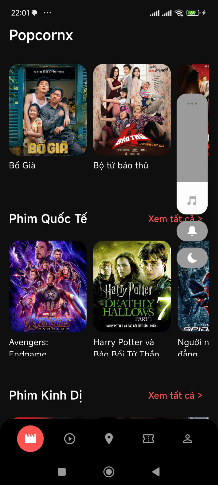
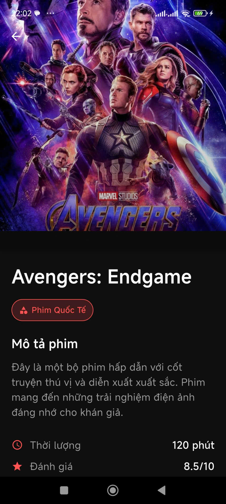
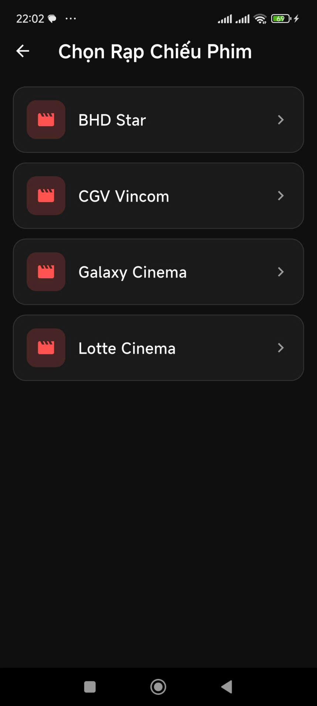
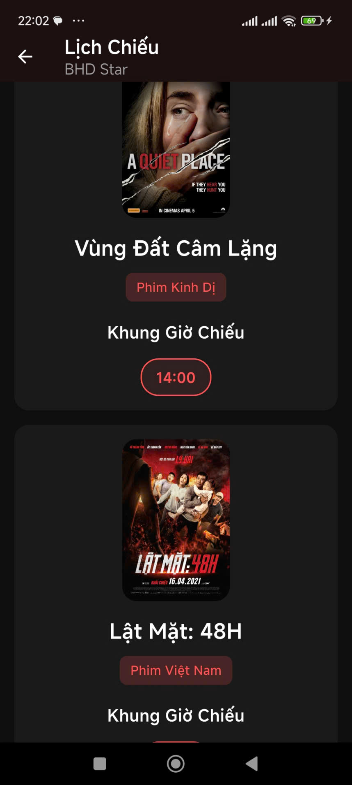
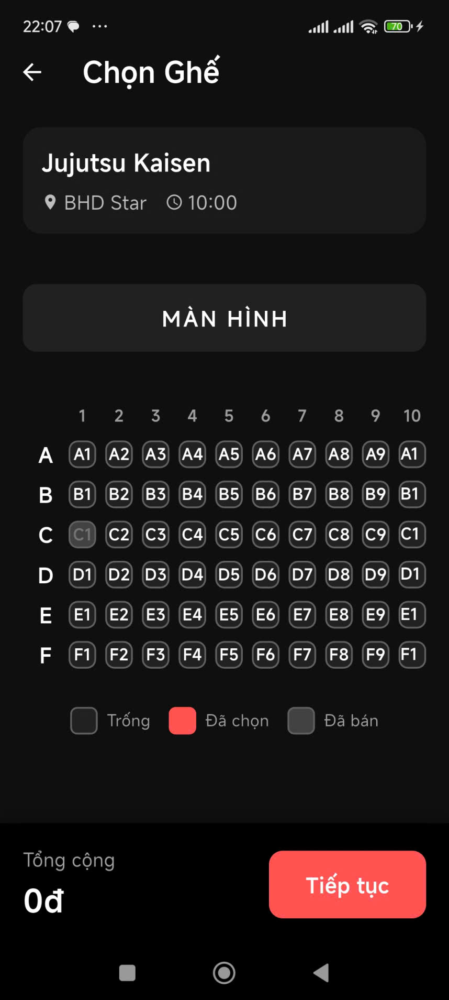
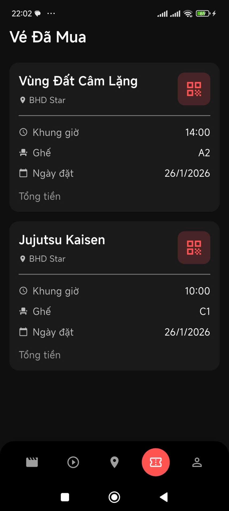

# 🎬 PopcornX

<div align="center">


**Ứng dụng đặt vé xem phim đa nền tảng được phát triển bằng Flutter**

[Giới thiệu](#-tổng-quan-dự-án) • [Tính năng](#-tính-năng-chính) • [Cài đặt](#-hướng-dẫn-cài-đặt) • [Tech Stack](#-tech-stack)

</div>

---

## 📋 Tổng quan dự án

**PopcornX** là ứng dụng đặt vé xem phim đa nền tảng được phát triển bằng Flutter, mô phỏng hệ thống bán vé của các rạp chiếu phim lớn như CGV, BHD. Ứng dụng cung cấp trải nghiệm đặt vé hoàn chỉnh từ việc xem danh sách phim, chọn suất chiếu, đặt ghế đến thanh toán và nhận vé điện tử.

### 🎯 Mục tiêu dự án

- ✅ Xây dựng ứng dụng hoàn chỉnh với giao diện đẹp, mượt mà và dễ sử dụng
- ✅ Áp dụng Flutter kết hợp Firebase/Backend đúng theo nội dung môn học
- ✅ Quản lý toàn bộ source code trên GitHub để phục vụ việc kiểm tra và đánh giá
- ✅ Tạo nền tảng có thể mở rộng và phát triển trong tương lai

### 🎬 Luồng sử dụng chính

```
Đăng nhập → Chọn phim → Chọn rạp → Chọn suất chiếu → Chọn ghế → Thanh toán → Nhận vé điện tử
```

---

## 🛠 Tech Stack

### Framework & Ngôn ngữ


- **Framework**: Flutter 3.10.4+
- **Ngôn ngữ**: Dart 3.10.4+
- **State Management**: StatefulWidget + StreamBuilder/FutureBuilder
- **Kiến trúc**: MVC (Model-View-Controller)

### Backend & Database


- **Backend**: Firebase
  - 🔐 **Firebase Authentication** - Xác thực người dùng
  - 💾 **Cloud Firestore** - Cơ sở dữ liệu NoSQL
  - 📱 **Firebase Messaging** - Push notifications
  - ⚙️ **Firebase Remote Config** - Cấu hình từ xa

### Authentication

- 📧 Email/Password Authentication
- 🔵 Google Sign-In Integration

### UI/UX

- 🎨 Material Design
- 🖼️ Custom SVG Icons
- 🌐 Đa ngôn ngữ (i18n) với `intl` package

### Async Operations

- ⚡ Future & Stream API
- 🔄 Real-time data synchronization với Firestore

---

## ✨ Tính năng chính

### 👤 Dành cho người dùng

#### 🔐 Xác thực người dùng
- ✅ Đăng ký / Đăng nhập bằng Email & Password
- ✅ Đăng nhập bằng Google (Firebase Auth)
- ✅ Quên mật khẩu
- ✅ Quản lý phiên đăng nhập

#### 🎬 Xem phim
- ✅ Danh sách phim đang chiếu
- ✅ Danh sách phim sắp chiếu
- ✅ Lọc phim theo thể loại
- ✅ Tìm kiếm phim

#### 📽️ Chi tiết phim
- ✅ Thông tin đầy đủ: Tên phim, Poster, Thời lượng
- ✅ Đạo diễn, diễn viên
- ✅ Mô tả nội dung phim
- ✅ Trailer (YouTube Player) - *Có thể mở rộng*

#### 🏢 Chọn rạp
- ✅ Danh sách rạp (CGV, BHD, Galaxy...)
- ✅ Hiển thị địa chỉ rạp
- ✅ Thông tin phòng chiếu

#### ⏰ Suất chiếu
- ✅ Chọn ngày chiếu
- ✅ Danh sách giờ chiếu tương ứng
- ✅ Hiển thị trạng thái ghế còn trống

#### 💺 Chọn ghế (Seat Booking)
- ✅ Sơ đồ ghế trực quan (A–F, số 1–12)
- ✅ Trạng thái ghế:
  - 🟢 Trống
  - 🔴 Đã đặt
  - 🟡 Đang chọn
- ✅ Tính tổng tiền theo loại ghế
- ✅ Xác nhận trước khi đặt

#### 💳 Thanh toán
- ✅ Thanh toán mô phỏng (Demo Payment)
- ✅ Hiển thị thông tin đầy đủ:
  - Phim đã chọn
  - Rạp và suất chiếu
  - Ghế đã chọn
  - Tổng tiền

#### 🎫 Vé điện tử
- ✅ Xuất vé điện tử sau khi đặt thành công
- ✅ Mã QR Code
- ✅ Hiển thị đầy đủ thông tin vé
- ✅ Lưu vé vào mục "Vé của tôi"

#### 📜 Lịch sử đặt vé
- ✅ Danh sách các vé đã đặt
- ✅ Xem lại thông tin vé và mã QR
- ✅ Lọc và tìm kiếm vé

#### 👤 Trang cá nhân
- ✅ Xem & chỉnh sửa thông tin cá nhân
- ✅ Đổi avatar
- ✅ Cập nhật tên và email
- ✅ Quản lý tài khoản

## 🚀 Hướng dẫn cài đặt

### Yêu cầu hệ thống

- Flutter SDK 3.10.4 hoặc cao hơn
- Dart SDK 3.10.4 hoặc cao hơn
- Android Studio / VS Code với Flutter extension
- Firebase account (để cấu hình backend)
- Git

### Bước 1: Clone repository

```bash
git clone https://github.com/your-username/popcornx.git
cd popcornx
```

### Bước 2: Cài đặt dependencies

```bash
flutter pub get
```

### Bước 3: Cấu hình Firebase

1. Tạo dự án Firebase mới tại [Firebase Console](https://console.firebase.google.com/)
2. Thêm ứng dụng Android và iOS vào dự án Firebase
3. Tải file `google-services.json` (Android) và `GoogleService-Info.plist` (iOS)
4. Đặt các file vào đúng thư mục:
   - `android/app/google-services.json`
   - `ios/Runner/GoogleService-Info.plist`
5. Cấu hình Firebase Authentication:
   - Bật Email/Password authentication
   - Bật Google Sign-In
6. Tạo Firestore Database và cấu hình security rules

### Bước 4: Chạy ứng dụng

```bash
# Chạy trên Android
flutter run

# Chạy trên iOS (chỉ macOS)
flutter run

# Chạy trên web
flutter run -d chrome
```

### Bước 5: Build ứng dụng

```bash
# Build APK cho Android
flutter build apk --release

# Build IPA cho iOS (chỉ macOS)
flutter build ios --release

# Build cho web
flutter build web
```

---

## 📂 Cấu trúc dự án

```
lib/
├── firebase_options.dart          # Cấu hình Firebase
├── main.dart                      # Entry point
├── models/                        # Data models
│   ├── booking.dart
│   ├── cinema.dart
│   ├── movie.dart
│   ├── showtime.dart
│   └── user.dart
├── navigation/                    # Navigation management
│   ├── app_navigator.dart
│   ├── app_page_route.dart
│   └── app_routes.dart
├── routes/                        # Route definitions
│   └── routes.dart
├── screens/                       # UI Screens
│   ├── all_movies_screen.dart
│   ├── cinema_selection_screen.dart
│   ├── cinema_showtimes_screen.dart
│   ├── dashboard_screen.dart
│   ├── forget_password_screen.dart
│   ├── movie_detail_screen.dart
│   ├── movies_by_cinema_screen.dart
│   ├── my_tickets_screen.dart
│   ├── payment_screen.dart
│   ├── profile_screen.dart
│   ├── seat_selection_screen.dart
│   ├── signin_screen.dart
│   ├── signup_screen.dart
│   └── welcome_screen.dart
├── services/                      # Business logic & API services
│   ├── auth_service.dart
│   ├── firestore_service.dart
│   ├── my_tickets.dart
│   ├── payment.dart
│   ├── remote_config_service.dart
│   └── seat_selection.dart
├── theme/                         # App theming
│   └── theme.dart
└── widgets/                       # Reusable widgets
    └── ...
```

---
## 📱 Giao diện ứng dụng

### 🎬 1. Trang chủ & khám phá phim
<p align="center">
  
  
</p>

### 🏢 2. Chọn rạp & suất chiếu
<p align="center">
  
  
</p>

### 💺 3. Chọn ghế & thanh toán
<p align="center">
  
</p>

### 🎟️ 4. Vé của tôi
<p align="center">
  
</p>

<p align="center">
  <i>Hình ảnh giao diện minh họa luồng sử dụng chính của ứng dụng PopcornX</i>
</p>


## 🔄 Luồng xử lý chính

### Luồng đặt vé

```
1. Người dùng đăng nhập/đăng ký
   ↓
2. Xem danh sách phim đang chiếu
   ↓
3. Chọn phim muốn xem
   ↓
4. Xem chi tiết phim
   ↓
5. Chọn rạp chiếu
   ↓
6. Chọn ngày và suất chiếu
   ↓
7. Chọn ghế ngồi
   ↓
8. Xác nhận thông tin và thanh toán
   ↓
9. Nhận vé điện tử với QR Code
   ↓
10. Lưu vé vào "Vé của tôi"
```

### Luồng xác thực

```
1. Màn hình Welcome
   ↓
2. Chọn Đăng nhập hoặc Đăng ký
   ↓
3. Xác thực với Firebase Auth
   ↓
4. Lưu thông tin người dùng vào Firestore
   ↓
5. Chuyển đến Dashboard
```

---

## 🧪 Testing

> ⚠️ *Phần testing có thể được mở rộng trong tương lai*

```bash
# Chạy unit tests
flutter test

# Chạy integration tests
flutter test integration_test/
```

---

## 📝 Ghi chú

- 📚 Dự án phục vụ mục đích học tập và nghiên cứu
- 🎭 Dữ liệu có thể là mock hoặc demo data
- 🔄 Dự án có thể được mở rộng và cải thiện trong tương lai
- 🐛 Nếu phát hiện lỗi, vui lòng tạo issue trên GitHub

---

## 🤝 Đóng góp

Mọi đóng góp đều được chào đón! Nếu bạn muốn đóng góp cho dự án:

1. Fork dự án
2. Tạo branch mới (`git checkout -b feature/AmazingFeature`)
3. Commit các thay đổi (`git commit -m 'Add some AmazingFeature'`)
4. Push lên branch (`git push origin feature/AmazingFeature`)
5. Mở Pull Request

---

## 📄 License

Dự án này được phát hành dưới giấy phép MIT. Xem file `LICENSE` để biết thêm chi tiết.

---

## 👨‍💻 Tác giả

**Sinh viên CNTT**
- Trần Tiến Danh
- GitHub: https://github.com/Danhtran07

- Nguyễn Thị Thu Hiền
- Github: https://github.com/Nguyenhien171

---

## 🙏 Lời cảm ơn

- Flutter Team cho framework tuyệt vời
- Firebase Team cho backend services mạnh mẽ
- Cộng đồng Flutter Việt Nam
- Giảng viên và bạn bè đã hỗ trợ trong quá trình phát triển

---

<div align="center">

**⭐ Nếu dự án này hữu ích, hãy cho một star! ⭐**

Made with ❤️ by Flutter Developer

</div>
